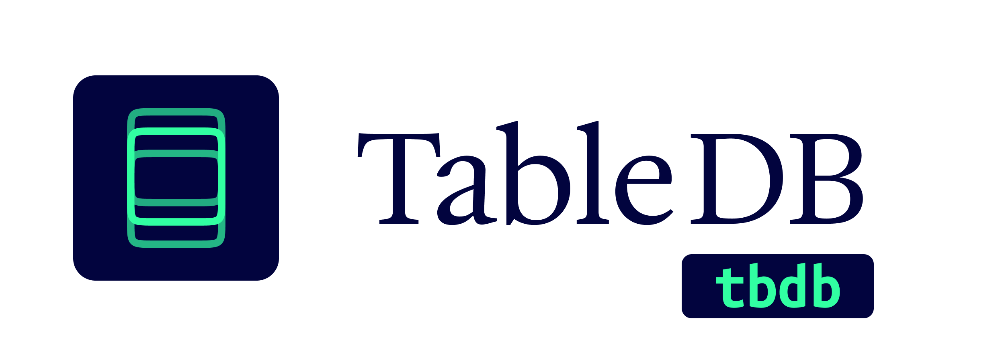

  

# TableDB

A very simple NoSQL database abstraction layer that provides MongoDB-like CRUD APIs, supporting multiple backends including SQLite, MongoDB and IndexedDB.

---

> 这个世界上复杂的数据库和 ORM 已经够多了，而我们只想简单地存个东西。

一个非常简单却实用的 NoSQL 数据库抽象层，提供类似 MongoDB 的增删改查 API，支持多种存储后端（SQLite, MongoDB, IndexedDB）。

- **完全兼容 JavaScript 数据类型**\
   直接存入 `Date`, `Map`, `RegExp`, `ArrayBuffer`,`Unint8Array`, `Blob`, `File` 等 JavaScript 类型，取出后数据类型不变，不用额外考虑数据库类型问题。
- **类似 MongoDB 的 NoSQL API**\
   增删改查的接口遵照 MongoDB 设计，例如 `findOne()`, `updateMany()`，易于上手，可以平滑的从 MongoDB 迁移。
- **切换不同数据库后端**\
   提供 SQLite, MongoDB 等多种数据库适配器，可以方便的切换不同的数据库存储后端。
  并且可以在不同数据库间迁移数据，让你可以从 SQLite 开始，当规模变大时迁移到 MongoDB。

- **集成实用方法**\
  内置 “分页”、“游标分页”、“批量遍历”等实用功能。

- **可选功能**：
    - `autoMetadata` 自动元数据（创建时间，修改时间）
    - `markDelete` 标记删除
    - `tree` 目录树存储
